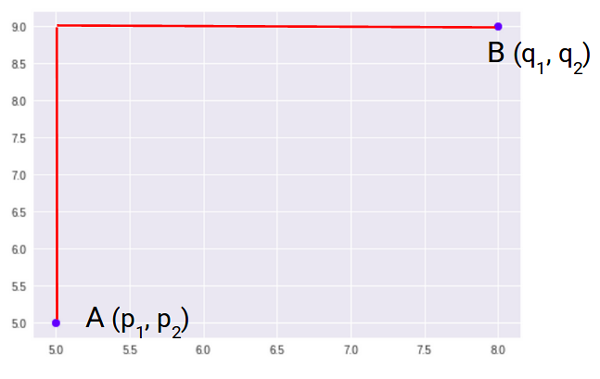

## Technical Question3 

#### Q1. Assume a 2D Grid of constrained straight interlocking paths with well defined start and end points. What metric should you use to comparedistances between any two different paths? Why is it better than other metrics available? List out some of the other metric
________
 **I learnt about various metrics used in machine learning and their interpretations. Here are a few key metrics along with my understanding of them:**
 #### 1. Euclidean Distance
  The Euclidean distance is the straight-line distance between two points in an n-dimensional space.
  It represents the shortest distance between two vectors.It is majorly used in nearest neighbour methods.
  
The Euclidean distance between two points $(x_1,y_1)$ and $(x_2,y_2)$ is given by:

$$
d = \sqrt{(x_2 - x_1)^2 + (y_2 - y_1)^2}
$$

where:
- $d$ is the Euclidean distance,
- $(x_1, y_1)$ and $(x_2, y_2)$ are the coordinates of the two points.

 #### 2. Manhattan Distance
  Manhattan Distance is the sum of absolute differences between points across all the dimensions.

  
The Manhattan distance between two points $(x_1, y_1)$ and $(x_2, y_2)$ is given by:

$$
d = |x_2 - x_1| + |y_2 - y_1|
$$

where:
- $d$ is the Manhattan distance,
- $(x_1, y_1)$ and $(x_2, y_2)$ are the coordinates of the two points.

#### 3. Mahalanobis Distance
The Mahalanobis distance takes into account the covariance structure of the data and measures the distance between a point and a distribution.

The Mahalanobis distance between two points $x$ and $y$, given a covariance matrix $S$, is defined as:

$$
d(x,y) = \sqrt{ (x-y)^\top S^{-1} (x-y) }
$$

where:
- $d(x,y)$ is the Mahalanobis distance,
- $x$ and $y$ are vectors representing the points,
- $S$ is the covariance matrix.

 
#### 3. Hamming Distance
The Hamming distance is the number of positions at which the corresponding coordinates of two vectors differ. It measures the similarity between two strings. It works only if strings are of some length. 
 
 

#### The choice of metric distance depends on requirements and constraints of environment and as per my understanding of distance metrics, I think in the case of 2D grid with interlocking paths *Manhattan distance* is the most appropriate choice.

#### Here are few reasons why I think Manhattan distance is best in this case:
* It accurately models the actual distance traveled in a grid environment, where only horizontal and vertical movements are allowed, and diagonal movements are prohibited.
* It aligns with the concept of city blocks, where the distance between two points is the sum of the absolute differences between their coordinates.
* Avoids overestimation or underestimation errors associated with other metrics that assume diagonal movements or consider only maximum coordinate differences.

  

$$
d = |p_2 - p_1| + |q_2 - q_1|
$$

